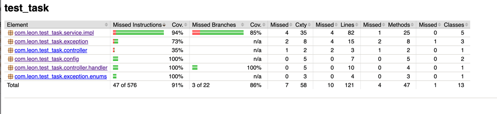

# Leon test task

## How to run application

1. Clone repository, go to root directory
2. Run `sh run.sh` in root directory

`sh run.sh` will build the application and run it in a docker container.

3. Open http://localhost:8008/ in browser
4. Enter the phone number and click "Submit" button

5. You will see the result. If the phone number is valid, you will see the country name.
   If the phone number is invalid, you will see the error message.

Example of a **valid** phone number:

Example of an **invalid** phone number:

## How to run tests

1. Clone repository, go to root directory
2. Run `./gradlew clean build test` in root directory
3. You will see the test results in the console

4. If you want to see the test report, run `./gradlew clean test jacocoTestReport` in root directory
5. You will see the test report in `build/reports/jacoco/test/html/index.html`
6. Open `index.html` in browser
7. You will see the test report

Example of a test report:

